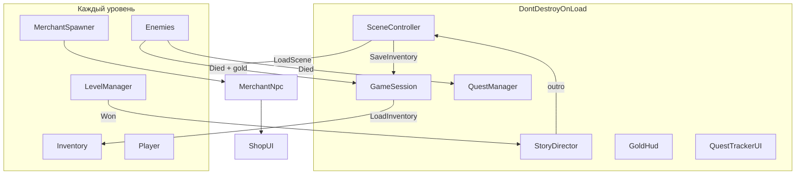

# Руководство по разработке с нуля: Bones of the Damned

> Репозиторий: `Rep2DLab`  
> Unity: **2022.3.44f1 LTS**  
> Название продукта: **Bones of the Damned**

Документ описывает, как с нуля собрать эту 2D action-RPG: от пустого Unity-проекта до полного цикла **GameStart → 5 уровней → GameFinish**.

---

## Содержание

1. [Обзор игры](#1-обзор-игры)
2. [Структура проекта](#2-структура-проекта)
3. [Архитектура и паттерны](#3-архитектура-и-паттерны)
4. [Игровые системы](#4-игровые-системы)
5. [Поток сцен](#5-поток-сцен)
6. [Данные: ScriptableObject и Resources](#6-данные-scriptableobject-и-resources)
7. [Сторонние ассеты](#7-сторонние-ассеты)
8. [Пошаговая разработка с нуля](#8-пошаговая-разработка-с-нуля)
9. [Текущее состояние и технический долг](#9-текущее-состояние-и-технический-долг)

---

## 1. Обзор игры

### Жанр

**2D top-down action-RPG** с пошаговым прохождением арен:

- движение и ближний бой со скелетами;
- инвентарь, экипировка, зелья;
- квесты «убить N врагов»;
- сюжетные диалоги между уровнями;
- торговец, золото, покупка легендарного оружия после квеста;
- сундуки с случайным лутом.

### Сеттинг

Герой защищает деревню **«Тихий Берег»** от армии скелетов. Путь проходит через:

| Уровень | Локация | Сюжетный акцент |
|---------|---------|-----------------|
| FirstLevel | Деревня | Скелеты у ворот |
| SecondLevel | Лес | Ополчение, знамя |
| ThirdLevel | Сторожевая башня | Дневник капитана, проклятие |
| FourthLevel | Старое кладбище | Скелеты — бывшие жители |
| FifthLevel | Каменный Круг | Финальный ритуал |
| GameFinish | Возвращение | Разговор со старейшиной |

### Управление

| Клавиша | Действие |
|---------|----------|
| WASD / стрелки | Движение |
| Space | Атака |
| Left Shift | Рывок (краткая неуязвимость) |
| Left Ctrl | Блок щитом (урон ×0.25) |
| I | Инвентарь |
| Q | Быстрое использование зелья |
| E | Разговор с NPC / торговец |
| Enter | Открыть сундук |
| Esc | Закрыть магазин |

### Технологии

| Компонент | Решение |
|-----------|---------|
| Движок | Unity 2022.3 LTS |
| Графика | 2D Sprite + Tilemap |
| Физика | Physics2D, Rigidbody2D |
| UI | uGUI + TextMeshPro |
| Камера | Cinemachine Virtual Camera |
| Анимации | Animator + Animation Events |
| Твины | DOTween |
| Данные | ScriptableObject + `Resources.Load` |

---

## 2. Структура проекта

```
Rep2DLab/
├── Assets/
│   ├── Animation/              # Animator Controllers, .anim
│   ├── Equipement/             # ScriptableObject предметов (не в Resources)
│   │   ├── weapons/common|rare/
│   │   ├── armor/, helmets/, Shields/
│   │   └── consumables/
│   ├── Prefabs/                # Player, Skeleton, Chest, UI
│   ├── Resources/              # Runtime-загрузка
│   │   ├── Story/              # LevelStory
│   │   ├── Quests/             # Quest
│   │   └── Merchant/           # MerchantCatalog
│   ├── Scenes/                 # GameStart, FirstLevel…GameFinish
│   ├── Scripts/                # Игровая логика (~55 скриптов)
│   ├── Sprites/                # Тайлы, персонажи, UI
│   ├── Music/, Sound/          # Аудио
│   ├── Plugins/Demigiant/DOTween/
│   └── TextMesh Pro/
├── Packages/manifest.json
├── ProjectSettings/
└── DEV_GUIDE.md                # Этот файл
```

### Организация `Scripts/`

```
Scripts/
├── Character/     # Fighter, Health, Trigger, CharacterBootstraper
├── Chest/         # Chest, ChestAnimator
├── Dialogues/     # StartDialogue, FinishDialog
├── Enemy/         # EnemyFighter, SkeletonMover, EnemyAnimator
├── Inventory/     # Inventory, EqupimentManager, InventoryUi, ItemSlot
├── Merchant/      # MerchantNpc, ShopUI, MerchantSpawner, GoldHud
├── Music/         # MusicPlayer, WinSound, EnemySound
├── NPCS/          # NPCMover, NPCAnimator (интро)
├── Player/        # PlayerMover, PlayerFighter, PlayerDash, PlayerAnimator
├── Quest/         # QuestManager, Quest, QuestNpc, QuestTrackerUI
├── Story/         # StoryDirector, LevelStory, StoryDialogueUI
├── Time/          # FirstSceneLoader, PlayerStartMover
├── UI/            # HealthBar, Bar
└── Utils/         # SceneController, GameSession, LevelManager, Item, PlayerFreeze
```

---

## 3. Архитектура и паттерны

### Singleton (DontDestroyOnLoad)

Объекты, живущие между сценами:

| Класс | Роль |
|-------|------|
| `SceneController` | Загрузка сцен, инициализация систем |
| `GameSession` | Инвентарь, золото, прогресс квестов |
| `StoryDirector` | Intro/outro диалоги |
| `QuestManager` | Квесты и награды |
| `MusicPlayer` | Фоновая музыка |

Статические UI-синглтоны: `GoldHud`, `QuestTrackerUI`.

### События (Observer)

- `Health.Changed`, `Health.Died`
- `EnemyFighter.Died` → квесты, золото, счётчик уровня
- `LevelManager.Won` → outro → следующая сцена
- `GameSession.GoldChanged` → HUD золота
- `QuestManager.QuestsChanged` → трекер квестов, магазин
- `Trigger.TriggerEntered/Exited` → сундуки, торговец, NPC

### Data-Driven Design

Логика отделена от данных через ScriptableObject:

- предметы (`Item`);
- квесты (`Quest`);
- сюжет (`LevelStory`);
- каталог торговца (`MerchantCatalog`).

### Runtime UI Factory

Часть интерфейса создаётся кодом, а не префабами:

- `StoryDialogueUI.Create()`
- `ShopUI.Open()`
- `QuestTrackerUI.Create()`
- `GoldHud.EnsureExists()`

### Persistence между сценами

```
LevelManager.Won
    → StoryDirector.PlayOutro()
    → SceneController.LoadScene()
        → GameSession.SaveInventory()
        → SceneManager.LoadScene()
        → GameSession.LoadInventory()
        → MerchantSpawner.SpawnForScene()
        → StoryDirector intro
        → QuestManager автостарт квестов
```

---

## 4. Игровые системы

### 4.1 Игрок

| Скрипт | Назначение |
|--------|------------|
| `PlayerMover` | WASD, Rigidbody2D, flip спрайта, `MovementLocked` |
| `PlayerFighter` | Атака, блок, урон с экипировкой, смерть |
| `PlayerDash` | Рывок 0.12 с, неуязвимость, cooldown 1.5 с |
| `PlayerAnimator` | Параметры Speed, Attack, Death, Win |
| `CharacterBootstraper` | Связывает Health + Fighter + HealthBar |

Формула урона: `max(урон_атакующего - защита_цели, 0)`.

### 4.2 Враги

- `EnemyFighter` — автоатака, когда игрок в триггере;
- `SkeletonMover` — враг статичен (не преследует);
- при смерти: +12 золота, уведомление `QuestManager.NotifyEnemyKilled()`;
- анимация атаки вызывает `PreformAttack()` через **Animation Event**.

### 4.3 Инвентарь

- **15 слотов** инвентаря + **4 слота** экипировки (меч, броня, щит, шлем);
- `Item` (SO): тип, урон, защита, лечение, цены, флаг `IsLegendary`;
- `ItemSlot` — drag-and-drop, клик для выбора;
- `EqupimentManager.SwapEquipment()` — старый предмет возвращается в инвентарь;
- `InventoryUi` — toggle **I**, кнопки Use/Drop, описание через TMP.

### 4.4 Сундуки

- подойти + **Enter**;
- случайный предмет по весам `DropChance`;
- `ChestAnimator` — анимация открытия.

### 4.5 Квесты

| ID | Название | Сцена | Цель |
|----|----------|-------|------|
| `clear_outskirts` | Очистить окраину | FirstLevel | 5 скелетов |
| `forest_patrol` | Лесной дозор | SecondLevel | 5 скелетов |
| `tower_ruins` | Руины башни | ThirdLevel | 6 скелетов |

- автостарт при входе на сцену (`AutoStartOnSceneEnter`);
- награда: зелье здоровья;
- `QuestTrackerUI` — панель квестов сверху по центру;
- прогресс сохраняется в `GameSession`.

### 4.6 Сюжет

- `LevelStory` — intro/outro строки для каждого уровня;
- `StoryDirector` — intro при загрузке, outro перед переходом;
- `StartDialogue` — посимвольный текст через DOTween `DOText`;
- `PlayerFreeze` — блокирует движение и бой на время диалога;
- пропускаются сцены `GameStart` и `GameFinish`.

### 4.7 Торговец и экономика

| Компонент | Описание |
|-----------|----------|
| `GameSession` | Стартовое золото: **50**, сохранение между уровнями |
| `GoldHud` | Отображение золота (правый верхний угол) |
| `MerchantSpawner` | Создаёт NPC на всех боевых уровнях |
| `MerchantNpc` | Взаимодействие по **E** |
| `ShopUI` | Вкладки «Купить» / «Продать» |

**Покупка:**

- обычные товары (зелья, базовая экипировка) — всегда;
- легендарные мечи — видны сразу, но заблокированы до выполнения квеста уровня;
- цена легендарки: `max(280, урон × 25)` золота.

**Продажа:**

- любые предметы из инвентаря и надетая экипировка;
- цена продажи: половина от цены покупки.

**Квест для разблокировки покупки легендарки:**

| Уровень | Квест |
|---------|-------|
| FirstLevel | Очистить окраину |
| SecondLevel | Лесной дозор |
| ThirdLevel | Руины башни |
| FourthLevel / FifthLevel | Очистить окраину (уже пройден) |

Каталог: `Resources/Merchant/VillageMerchant.asset`.

### 4.8 Уровни

`LevelManager`:

1. подписывается на `EnemyFighter.Died` у всех врагов сцены;
2. когда все мертвы → событие `Won`;
3. пауза 3 сек → outro диалог;
4. `SceneController.LoadScene(_newSceneName)`.

### 4.9 Интро и финал

**GameStart:**

`StartDialogue` → `BlackBoxStart` (fade) → `FirstSceneLoader` → FirstLevel.

**GameFinish:**

`FinishDialog` → `BlackBox` → `PlayerFinishMover`, NPC подходит к игроку.

---

## 5. Поток сцен

### Цепочка переходов (логика LevelManager)

```
GameStart  ──(FirstSceneLoader)──► FirstLevel
FirstLevel  ──► SecondLevel
SecondLevel ──► ThirdLevel
ThirdLevel  ──► FourthLevel
FourthLevel ──► FifthLevel
FifthLevel  ──► GameFinish
```

### Build Settings (текущее состояние)

В Build Settings сейчас:

```
GameStart → FirstLevel → SecondLevel → ThirdLevel → FourthLevel → GameFinish
```

**FifthLevel отсутствует в Build Settings**, хотя `FourthLevel` пытается загрузить `FifthLevel`. Это нужно исправить: добавить `Assets/Scenes/FifthLevel.unity` между FourthLevel и GameFinish.

### Диаграмма систем



---

## 6. Данные: ScriptableObject и Resources

### Типы ScriptableObject

| Класс | Menu Name | Где лежат |
|-------|-----------|-----------|
| `Item` | Inventory/Item | `Assets/Equipement/` |
| `Quest` | Quest/Quest | `Assets/Resources/Quests/` |
| `LevelStory` | Story/Level Story | `Assets/Resources/Story/` |
| `MerchantCatalog` | Merchant/Catalog | `Assets/Resources/Merchant/` |

### Resources (загрузка в runtime)

```
Resources/
├── Story/           # FirstLevelStory … FifthLevelStory
├── Quests/          # QuestLevel1 … QuestLevel3
├── Merchant/        # VillageMerchant (Борис-кузнец)
└── DOTweenSettings.asset
```

### Контент предметов

| Категория | Количество |
|-----------|------------|
| Оружие common | ~14 |
| Оружие rare (легендарное) | 12 |
| Броня | 4 |
| Шлемы | 4 |
| Щиты | 4 |
| Зелья | HealthPotion (+30 HP) |

### Префабы

| Префаб | Назначение |
|--------|------------|
| `Player.prefab` | Игрок со всеми компонентами |
| `Skeleton.prefab` | Базовый враг |
| `Chest.prefab` | Сундук с лутом |
| `PlayerStatsCanvas.prefab` | HUD игрока |

Торговец создаётся процедурно через `MerchantSpawner`, а не из префаба на сцене.

### Типичная боевая сцена

- Grid + Tilemap (Collision, Interaction);
- Main Camera + Cinemachine Virtual Camera;
- Player (prefab);
- группа Skeletons;
- Chests;
- LevelManager + SceneController + GameSession;
- InventoryCanvas (15 + 4 слота);
- MusicPlayer, EventSystem.

---

## 7. Сторонние ассеты

| Ассет | Использование |
|-------|---------------|
| **DOTween** | Текст диалогов, fade-экраны |
| **TextMesh Pro** | Описания в инвентаре |
| **Cinemachine** | Камера, следующая за игроком |
| **Fantasy Wooden GUI** | UI-текстуры |
| **InfinityPBR Progress Bar** | Шкала HP |
| **Thaleah Pixel Font** | Пиксельный шрифт |
| **25 RPG Game Tracks** | Боевая музыка |
| **SwordSoundPack** | Звуки мечей |

---

## 8. Пошаговая разработка с нуля

Ниже — рекомендуемый порядок, в котором логично собирать проект. Каждая фаза опирается на предыдущую.

### Фаза 0 — Подготовка

1. Создать Unity 2022.3 LTS **2D** проект.
2. Установить пакеты: **2D Feature**, **Cinemachine**, **TextMeshPro**.
3. Импортировать **DOTween**.
4. Настроить Input Manager (Horizontal, Vertical).
5. Создать слои Collision и Interaction.
6. Импортировать пиксель-арт: тайлы, персонажи, UI.

### Фаза 1 — Игрок и камера

1. Спрайт игрока + `Rigidbody2D` + `BoxCollider2D`.
2. `PlayerMover` — движение, отражение спрайта.
3. Animator: Idle, Move, Attack, Death, Win.
4. `Health` (обычный C# класс) + `CharacterBootstraper`.
5. `HealthBar` / `Bar` — UI здоровья.
6. Cinemachine Virtual Camera с follow.

**Результат:** игрок ходит по пустой сцене, видна полоска HP.

### Фаза 2 — Боевая система

1. `Trigger` — дочерний trigger-collider.
2. `Fighter` (abstract) — урон, защита, cooldown.
3. `PlayerFighter` — Space → анимация → Animation Event → урон.
4. `EnemyFighter` + `SkeletonMover` (статичный враг).
5. `EnemyAnimator` — атака, смерть, исчезновение.
6. Тестовая арена с 1–2 скелетами.

**Результат:** можно бить врагов и умирать.

### Фаза 3 — Уровни и переходы

1. Tilemap: земля + коллизии.
2. `LevelManager` — список врагов, победа, задержка, LoadScene.
3. `SceneController` + `GameSession` (Singleton, DontDestroyOnLoad).
4. Две сцены: FirstLevel, SecondLevel.
5. Сохранение инвентаря между сценами (пока пустого).

**Результат:** после убийства всех врагов загружается следующий уровень.

### Фаза 4 — Инвентарь

1. `Item` ScriptableObject + Create Asset Menu.
2. Ассеты оружия, брони, зелий в `Equipement/`.
3. `Inventory` — 15 слотов.
4. `ItemSlot` — UI с drag-and-drop.
5. `EqupimentManager` — 4 слота экипировки.
6. `InventoryUi` — **I**, Use/Drop, описание TMP.
7. Модификаторы урона/защиты в `PlayerFighter`.

**Результат:** предметы влияют на бой.

### Фаза 5 — Лут и сундуки

1. `Chest` — триггер + **Enter** + weighted random.
2. `ChestAnimator` — анимация открытия.
3. Расставить сундуки на уровнях с таблицей лута.

**Результат:** игрок находит экипировку в мире.

### Фаза 6 — Экономика и торговец

1. `GameSession` — золото (старт 50), `GoldChanged`.
2. `GoldHud` — runtime UI.
3. Дроп золота с врагов (`EnemyFighter._goldDrop = 12`).
4. `Item` — поля `BuyPrice`, `SellPrice`, `IsLegendary`, формулы цен.
5. `MerchantCatalog` SO в `Resources/Merchant/`.
6. `MerchantSpawner` — спавн на всех уровнях, позиции в `LevelSpawns`.
7. `MerchantNpc` — **E** открывает магазин.
8. `ShopUI` — покупка/продажа, блокировка легендарки до квеста.
9. `PlayerFreeze` — пауза управления в диалогах.

**Результат:** полноценный магазин с экономикой.

### Фаза 7 — Квесты

1. `Quest`, `QuestType`, `QuestState`, `QuestProgressData`.
2. `QuestManager` — `Resources.LoadAll<Quest>`.
3. `QuestTrackerUI` — HUD сверху по центру.
4. `NotifyEnemyKilled()` в `EnemyFighter`.
5. Автостарт квестов + награда-предмет.
6. Сохранение прогресса в `GameSession`.

**Результат:** квесты отслеживаются и влияют на магазин.

### Фаза 8 — Сюжет

1. `StartDialogue` / `FinishDialog` с DOTween.
2. `LevelStory` SO для каждого уровня.
3. `StoryDirector` — intro on load, outro before transition.
4. `StoryDialogueUI` — runtime canvas.
5. Написать тексты intro/outro (см. `Resources/Story/`).

**Результат:** между уровнями идёт повествование.

### Фаза 9 — Полировка игрока

1. `PlayerDash` — рывок + неуязвимость.
2. Блок щитом (Ctrl).
3. `TryUseConsumable` (Q).
4. `Slower` — зоны замедления.
5. Смерть → сброс экипировки → reload FirstLevel.

### Фаза 10 — Интро и финал

1. `GameStart.unity` — диалог, NPC, fade, `FirstSceneLoader`.
2. `GameFinish.unity` — финальный диалог, fade.
3. `NPCMover`, `PlayerStartMover`, `PlayerFinishMover`.
4. Все сцены в **Build Settings** в правильном порядке (включая FifthLevel).

### Фаза 11 — Контент

1. Пять уникальных tilemap-уровней.
2. Расстановка врагов, сундуков, торговца.
3. `LevelManager._newSceneName` для каждой сцены.
4. Квесты для уровней 4–5 (сейчас только 3).
5. Баланс: урон, HP, цены, DropChance.
6. Музыка и звуки (`MusicPlayer`, `WinSound`, `EnemySound`).

### Фаза 12 — Тестирование

Чеклист полного прохождения:

- [ ] GameStart → … → GameFinish без ошибок загрузки сцен
- [ ] Инвентарь, золото и квесты сохраняются между уровнями
- [ ] Торговец на всех 5 уровнях, магазин открывается по **E**
- [ ] Легендарное оружие покупается только после квеста уровня
- [ ] Смерть перезагружает FirstLevel
- [ ] Все клавиши управления работают
- [ ] Intro/outro диалоги не блокируют игру навсегда

---

## 9. Текущее состояние и технический долг

### Известные проблемы

1. **FifthLevel не в Build Settings** — после FourthLevel игра не сможет загрузить финальный уровень. Нужно добавить `FifthLevel.unity` в Build Settings.
2. **Квесты только для уровней 1–3** — для FourthLevel и FifthLevel квестов нет.
3. **`PreformAttack`** — опечатка в имени метода (используется в Animation Events, менять осторожно).
4. **`EqupimentManager`** — опечатка в названии класса.
5. **`Attacker.cs`** — пустой класс-заглушка.
6. Враги **не преследуют** игрока — атакуют только в зоне триггера.
7. Часть UI (магазин, сюжет, золото) создаётся кодом, а не префабами — удобно для прототипа, сложнее для дизайнеров.

### Что уже реализовано (на момент документа)

- Полный боевой цикл игрока (движение, атака, блок, рывок);
- 5 уровней + интро/финал;
- Инвентарь и экипировка;
- Квесты с автостартом и трекером;
- Сюжетные диалоги;
- Торговец на всех уровнях;
- Экономика золота;
- Покупка легендарного оружия после квеста;
- Продажа предметов из инвентаря и экипировки.

---

## Приложение: ключевые скрипты

| Скрипт | Путь | Роль |
|--------|------|------|
| `SceneController` | `Utils/SceneController.cs` | Загрузка сцен, persistence |
| `GameSession` | `Utils/GameSession.cs` | Инвентарь, золото, квесты |
| `LevelManager` | `Utils/LevelManager.cs` | Победа на уровне |
| `Item` | `Utils/Item.cs` | Данные предмета, цены |
| `PlayerMover` | `Player/PlayerMover.cs` | Движение |
| `PlayerFighter` | `Player/PlayerFighter.cs` | Бой игрока |
| `EnemyFighter` | `Enemy/EnemyFighter.cs` | Бой врага, золото |
| `Inventory` | `Inventory/Inventory.cs` | Хранение предметов |
| `QuestManager` | `Quest/QuestManager.cs` | Квесты |
| `StoryDirector` | `Story/StoryDirector.cs` | Сюжет |
| `MerchantSpawner` | `Merchant/MerchantSpawner.cs` | Спавн торговца |
| `ShopUI` | `Merchant/ShopUI.cs` | UI магазина |
| `PlayerFreeze` | `Utils/PlayerFreeze.cs` | Блокировка управления |

---

*Документ описывает проект **Bones of the Damned** (Rep2DLab) и может обновляться по мере развития игры.*
